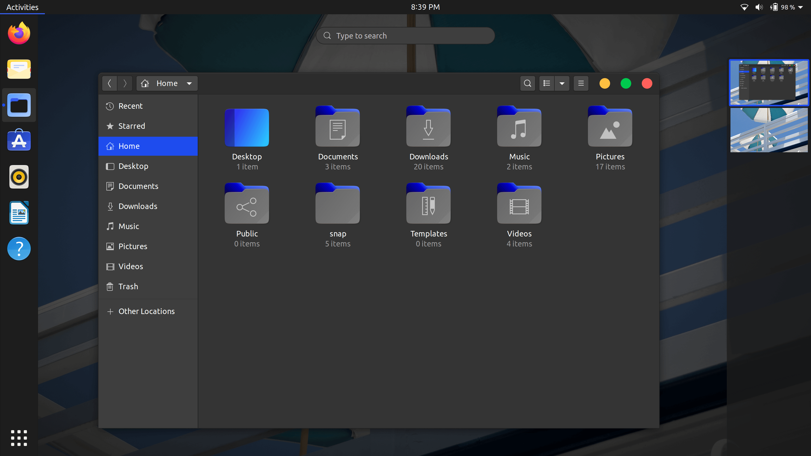

### Yaru-blue
Yaru-blue is a fork of [Yaru](https://github.com/ubuntu/yaru) theme.

Yaru-blue includes:
- GTK3 theme
- gnome-Shell theme
- Ubuntu-Dock theme (indicators)
- Yaru-blue icons

### Installation (default):
 1. Install **Tweaks**:
```
sudo apt install gnome-tweaks
```
 2. Install the User-themes extension from [here](https://extensions.gnome.org/extension/19/user-themes/).
 
 3.  Download `Yaru-blue` from [here](https://github.com/Muqtxdir/yaru-blue/releases/download/v20.04/Yaru-blue-20.04.tar.xz) 
 
 4. Copy contents of *Themes folder* to `~/.themes` or `/usr/share/themes`
 
 5. Copy contents of *Icons Folder* to `~/.icons` or `/usr/share/icons`
 
 6. The theme and icons can now be selected from **Tweaks**
 
*Note: Yaru-blue theme does not work with Snap and Flatpak apps*

### Installation (source):
If you would like to build from master, please follow instructions from [here](source.md).

### Screenshots
**Light:**


**Standard:**


**Dark:**



