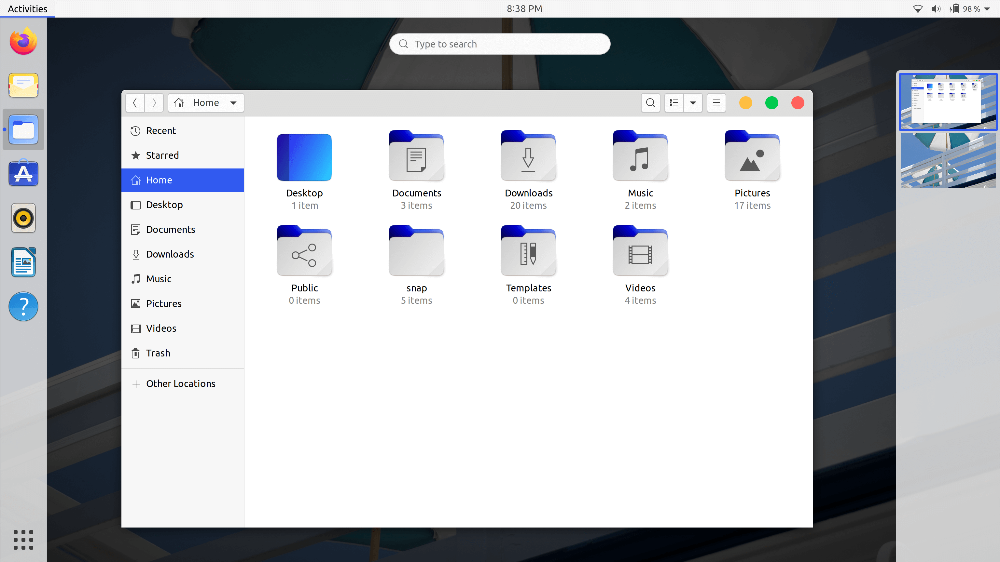
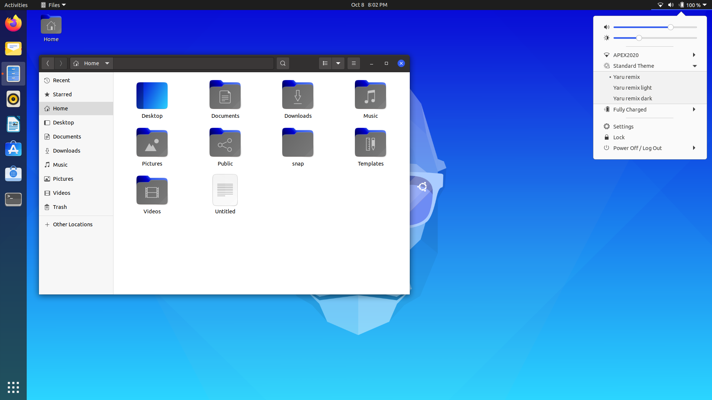
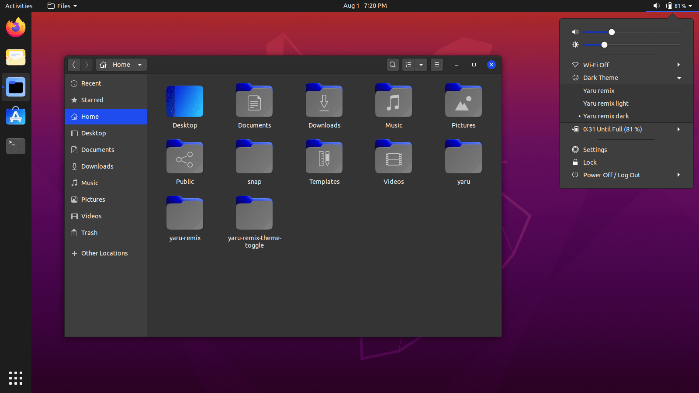

### Yaru-remix
Yaru-remix is a fork of [Yaru](https://github.com/ubuntu/yaru) theme.

Yaru-remix includes:
- GTK3 theme
- Gnome-Shell theme
- Yaru-remix icons
- Yaru-remix wallpaper
- [Yaru-remix-theme-toggle](https://github.com/Muqtxdir/yaru-remix-theme-toggle) extension
 
*Note: Yaru-remix theme does not work with Snap and Flatpak apps*

### Installation:
If you would like to build from master, please follow instructions from [here](install.md).

### Screenshots
**Light:**

**Standard:**

**Dark:**

