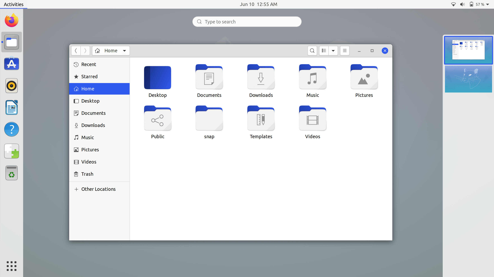
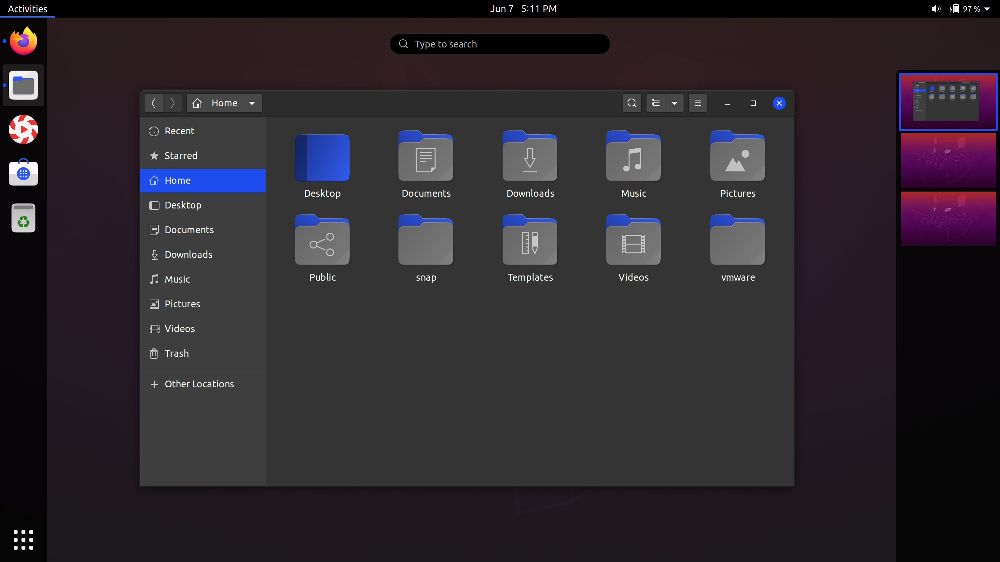
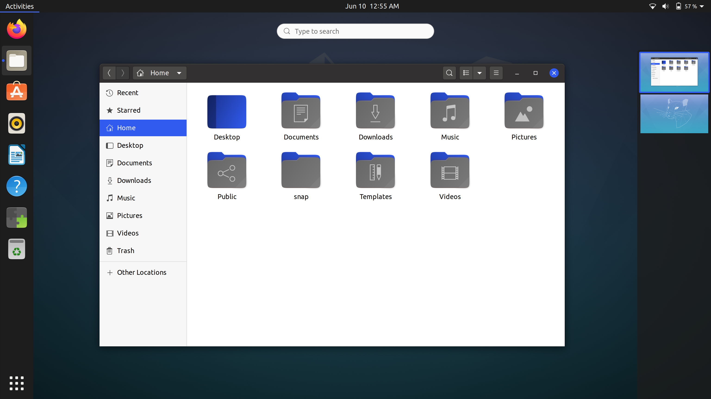

## Yaru-blue
Yaru-blue is a blue variant of [Yaru](https://github.com/ubuntu/yaru) theme.

Yaru-blue includes:
- GTK3 theme
- Gnome-Shell theme
- Ubuntu-Dock theme (indicators)
- Yaru-blue icons

## Screenshots
**Yaru-blue (Light):**


**Yaru-blue (dark):**


**Yaru-blue (standard):**


## Installation:

 1. Install **Tweaks**:
```
sudo apt install gnome-tweaks
```
 2. Install the [User Themes](https://extensions.gnome.org/extension/19/user-themes/) extension.
 
 3.  Download `Yaru-blue` from [here](https://github.com/Muqtxdir/yaru-blue/releases/download/v20.04.7/Yaru-blue-20.04.7.tar.xz) 
 
 4. Copy all contents of *Themes folder* to `~/.themes`
 
 5. Copy all contents of *Icons Folder* to `~/.icons`
 
 6. The theme and icons can now be selected from **Tweaks**
 
*Note: Yaru-blue theme does not work with Snap and Flatpak apps*
