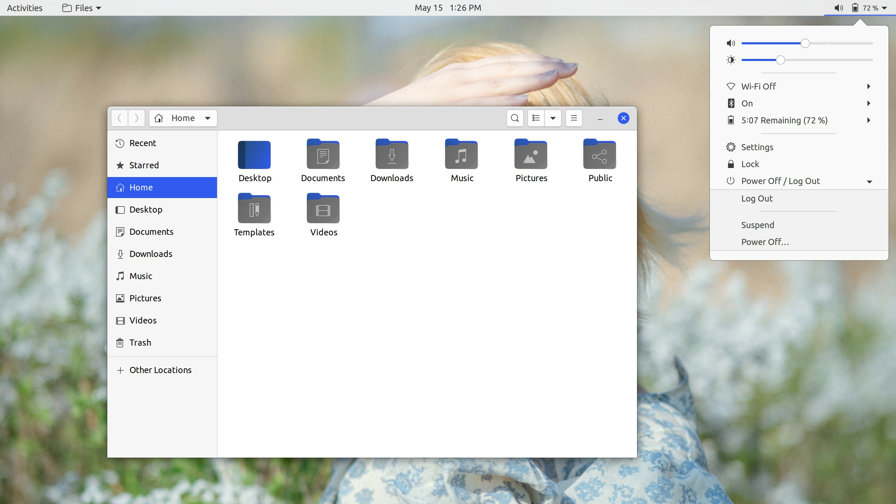
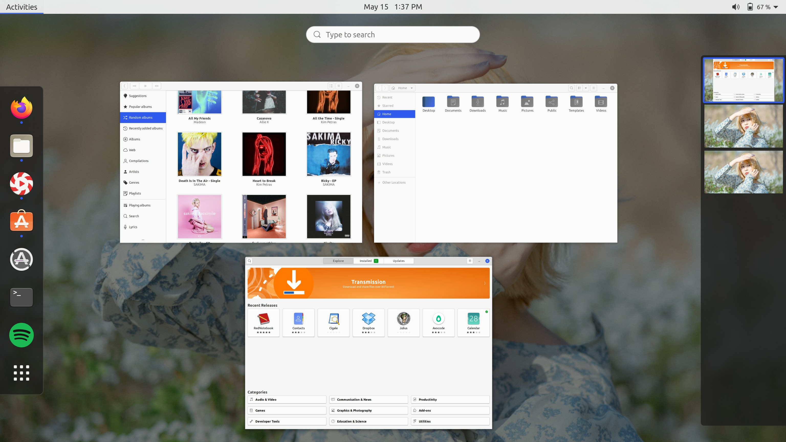
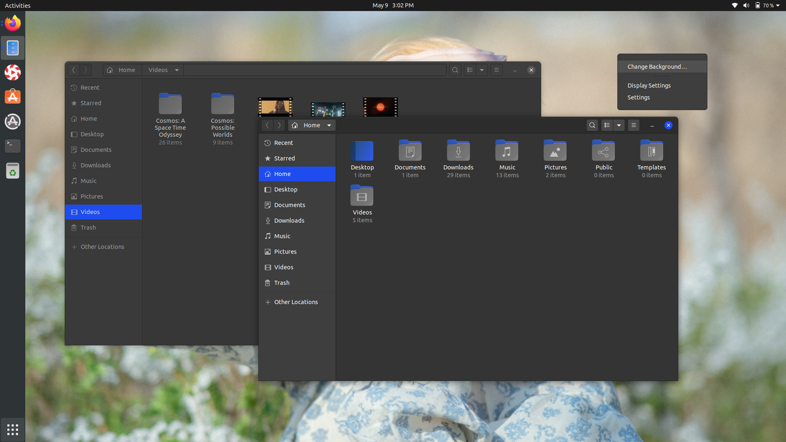
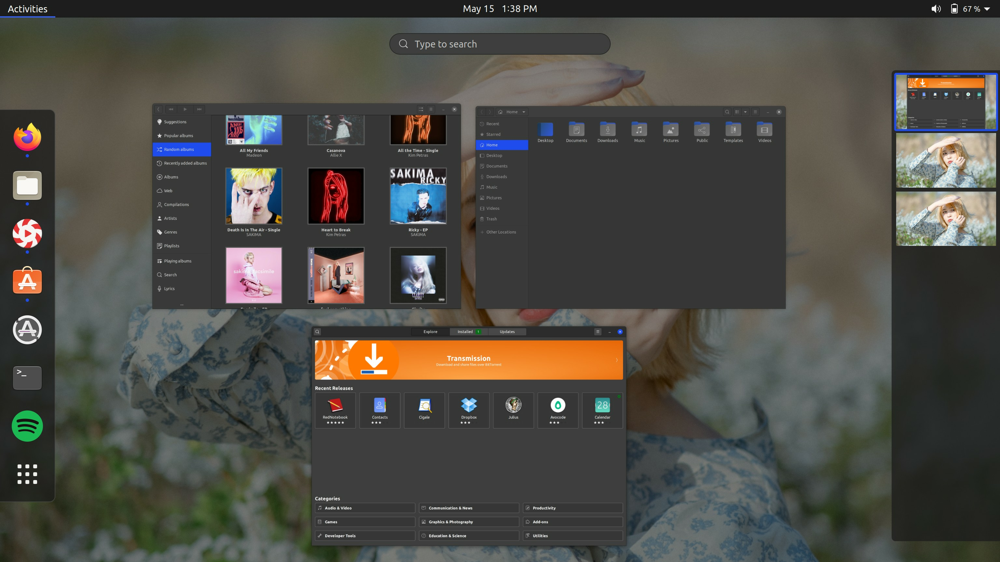

## Yaru-blue

This repository contains a modified Yaru theme. The idea for this project came from using the [Yaru-Colors](https://github.com/Jannomag/Yaru-Colors) project.

Tested on Ubuntu 20.04 (Gnome 3.36.1)

Yaru-blue theme contains the following:
- GTK 2 / 3 theme (light,standard,dark)
- Gnome-Shell theme (light,standard,dark)
- Yaru icons

## Screenshots
The following screenshots showcase Yaru-blue:

**Yaru-blue (Light):**

**Yaru-blue (dark)**

## Installation:
 1. Install GNOME Tweaks `sudo apt install gnome-tweaks`
 2. Install the [User Themes](https://extensions.gnome.org/extension/19/user-themes/) extension.
 3. Copy all contents of Themes folder to `~/.themes`
 4. Copy all contents of Icons Folder to `~/.icons`
 5. The theme can now be selected by using GNOME Tweaks
 
 That's it! You should now have the new theme applied to applications, the gnome-shell (dock etc.).

Feel free to open an issue if things don't work as expected.
